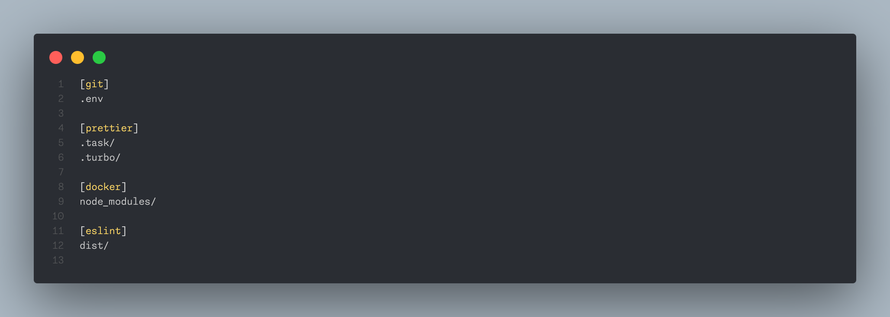

# `.ignorefile`

> **The ignore file not to be ignored** ([relevant thread](https://www.threads.net/@doseofted/post/C0kT-W2xpRp))



This is an attempt to [make a standard](https://xkcd.com/927/) for various ignore files in a single `.ignorefile` file. It is an INI-like file where contained in each section is the content of that specific ignore file.

This repository also serves as a tool to read the `.ignorefile` (as a step to be run with some git hook) and generate the specific ignore files as utilized by applications, while also appending to or creating a `.gitignore` file that ignores the ignore files, so they're not uploaded to git.

It's created in TypeScript to iterate quickly but may be rewritten in a language like Go should this become useful.

## What is `.ignorefile`?

It looks something like this:

```ini
[git]
# .gitignore
node_modules/
```

## Get Started

The command for generating the file will be ran like so (**it's a WIP**):

```zsh
npx dotignorefile@latest
```

## Development

```zsh
# Ensure you're on the right Node version
nvm install
# enable Corepack so pnpm gets installed automatically
corepack enable
# Build project (or `pnpm dev` for watch mode)
pnpm build
```

## Release

```zsh
pnpm changeset
```
